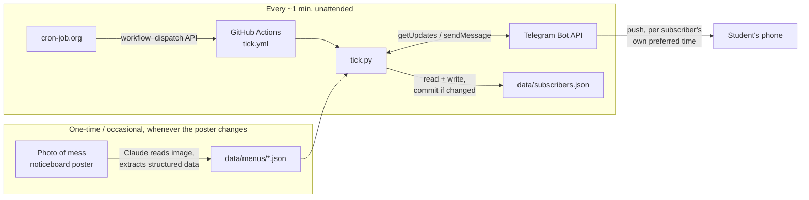

# NotiMess — Architecture

## 1. Overview

NotiMess is deliberately a **static-data + scheduled-script** system, not a live service. There's no server to keep running, no database beyond the repo itself, and no LLM call anywhere in the runtime path. The only "smart" step (reading the menu poster photo) happens once, offline, interactively with Claude — its output is a plain JSON file committed to the repo. Everything that runs on a schedule afterwards is small, dumb, and fast.

**Delivery channel: Telegram bot.** Chosen over a shared ntfy topic (no spoofing protection) and Web Push/PWA (needs a real backend + database + iOS limitations) — full comparison in §8. Since a Telegram bot needs no login and no per-user setup beyond `/start`, it serves both the original "notify me" goal and the "let anyone subscribe" goal at once — there's no separate personal-only build.



## 2. Why so few external services

An earlier draft of this architecture planned a webhook-based design: a serverless function (Vercel/Cloudflare) receiving Telegram's `/start` events in real time, backed by a key-value store (Upstash Redis) for the subscriber list. That works, but it means creating and maintaining two more third-party accounts for what is, functionally, a list of chat IDs.

**Simplification adopted:** Telegram's Bot API supports *polling* (`getUpdates`) as well as webhooks — a client can just ask "any new messages since last time?" instead of needing a public HTTPS endpoint to receive pushes. So instead of a webhook function + Redis, GitHub Actions polls, and the subscriber list is a JSON file **committed to the repo itself**, exactly like the menu data. This means:

- No new hosting platform, no database service, no secrets to manage outside GitHub Actions secrets.
- The tick workflow commits to the repo only on runs where something actually changed (a new subscriber, a preference change, a notification sent), which is a little unconventional but keeps everything in one place and auditable via git history.

**Further simplification (added with per-subscriber notification times, §11):** originally this was two separate workflows — a 4x/day `notify.yml` sending at fixed times, and a ~15-min `poll_subscribers.yml` capturing `/start`/`/stop`. Once each subscriber can pick their *own* time per meal, "send at a fixed time" no longer makes sense — the system instead needs to check frequently whether *anyone's* preferred time has just passed. That check has to run often anyway, so polling for new Telegram messages was folded into the same run: **one script (`tick.py`), one workflow (`tick.yml`).** This also removes a subtle risk the two-workflow design had — two independently-scheduled jobs writing to the same `data/subscribers.json` — since there's now only ever one writer.

**Third account added after all, and why (§3.3):** the plan through this point was "only GitHub + Telegram, ever." In production, GitHub's own `schedule` trigger turned out to be too unreliable at 5-minute granularity to actually deliver on that — see §3.3 for what was observed and why. The fix needs *something* outside GitHub to reliably poke the workflow on time, since the unreliable part is GitHub's own scheduler. cron-job.org was picked as the smallest possible version of that: no code, no cloud infrastructure, just a dashboard config calling one REST endpoint. It's a real third account, kept deliberately thin — it only ever dispatches the existing workflow, never touches subscriber data or the Telegram token directly (the PAT it holds is scoped to nothing but "trigger this one workflow").

## 3. Components

### 3.1 Menu data store — `data/menus/*.json`
- Single source of truth for what's being served.
- Structure: meal-major. Top-level `meals` object keyed by `breakfast`/`lunch`/`high_tea`/`dinner`, each carrying its time window (`time`, `counter_closing_time`) and an `items` object keyed by day name (`"Monday"`..`"Sunday"`) → flat list of dish strings. One file per institution+month (e.g. `vit_bhopal_mess_menu_september_2026.json`).
- Treated as **read-only by the scheduled jobs** — it only ever gets updated by a human (with Claude's help) re-parsing a new poster photo.
- The current file was corrected once already (see `MEMORY.md` change log, 2026-09-14) after a user-supplied re-transcription fixed several cells an earlier automated pass got wrong — a concrete reminder that a fresh poster photo should always be spot-checked, not just trusted from a single vision pass.

### 3.2 Subscriber store — `data/subscribers.json`
- JSON object keyed by `chat_id` (string), each holding `prefs` (per-meal preferred time) and `last_sent` (per-meal last-sent date) — see §4 for the exact shape.
- Owned exclusively by `tick.py` — the only script that reads or writes it.
- Committed to the repo by the tick workflow using the built-in `GITHUB_TOKEN` (no extra credential needed).
- **Deliberately public**, along with the rest of the repo (decision confirmed 2026-09-15 — see `MEMORY.md`). The only field this ever stores per subscriber is the bare numeric `chat_id`: no name, username, or phone number is captured from Telegram's message payload. That's real but bounded exposure — a permanent, public list of "these Telegram accounts use NotiMess and prefer their notifications at these times." Judged acceptable for a free hostel tool; the alternative (a second private repo + access token) was considered and explicitly declined in favor of staying simple.

### 3.3 Scheduler — GitHub Actions (`.github/workflows/tick.yml`), triggered externally

- Chosen over local cron because it doesn't depend on any personal device being powered on (reliability requirement).
- `workflow_dispatch` is the trigger that actually matters in practice — see below. `schedule: '*/5 * * * *'` is kept only as a free, best-effort fallback.
- `concurrency: { group: notimess-tick, cancel-in-progress: false }` so overlapping runs queue instead of clashing if a run ever takes longer than the interval between triggers.
- Public repo → GitHub Actions minutes are unlimited on standard runners, so frequent runs cost nothing regardless of how they're triggered.

**GitHub's own `schedule` trigger turned out to be unreliable at 5-minute granularity — discovered in production, not anticipated in the original design.** Observed: over the first ~14 hours after this workflow went live, `schedule`-triggered runs fired only 3 times (roughly every 2–3 hours) instead of the expected ~168, including one gap over 4 hours long that spanned a subscriber's breakfast notification time — it was never checked, so it was never sent. This matches GitHub's own documented behavior and widely-reported community experience: scheduled workflows run on shared, best-effort infrastructure, are explicitly *not* guaranteed to fire at the configured time, and are especially prone to multi-hour delays on public repos with low overall activity (GitHub also disables `schedule` entirely after 60 days with zero repo activity, though that wasn't the issue here). By contrast, `workflow_dispatch` runs (triggered manually or via the REST API) are *not* subject to this cron-specific throttling — every manual test during debugging started within ~15 seconds.

**Fix: an external scheduler dispatches the workflow instead of relying on GitHub's internal one.** [cron-job.org](https://cron-job.org) (free, no card required, supports POST + custom headers + 1-minute minimum interval) calls GitHub's `workflow_dispatch` REST API every 1 minute — tightened from an initial 5-minute plan once `/menu` (§12) made the interval-bound lag directly noticeable in an interactive, click-and-wait context, not just a scheduled push where a few minutes' lateness barely registers:

```
POST https://api.github.com/repos/eklavyamathur9/NotiMess/actions/workflows/tick.yml/dispatches
Headers: Authorization: token <fine-grained PAT, Actions: write only on this repo>
         Accept: application/vnd.github+json
Body:    {"ref": "main"}
```

This is the same approach GitHub's own community discussions recommend for anything needing real timing precision (also cited: AWS EventBridge Scheduler, Cloudflare Workers Cron Triggers — cron-job.org was chosen over both for needing zero code and zero cloud account beyond GitHub + Telegram). See `PLAN.md` for the setup steps (a one-time GitHub PAT + a five-minute cron-job.org dashboard config, both manual steps only the repo owner can do).

Combined with the "at or after" delivery semantics in §11, an occasional missed or delayed dispatch (from either trigger) still self-heals on the next successful run — nothing is silently skipped, only delayed.

### 3.4 Tick script — `tick.py`
Runtime logic, no external LLM/API dependency. One run does both of:
1. **Poll for new messages:** call Telegram's `getUpdates` with an `offset` past the last-seen update ID (persisted in `data/subscribers.json` so nothing is double-processed). Route any `/start`, `/menu`, `/full`, `/vegonly`, `/stop`, `/settime`, `/mytimes`, `/reset` command to its handler (§11, §12, §13).
2. **Check and send due notifications:** for every subscriber, for every meal, compare their preferred time (default or custom) against the current `Asia/Kolkata` time; if it's passed and today's notification for that meal hasn't been sent yet, build the message (menu lookup + format per `PRD.md` §8) and send it via `sendMessage`.
3. If a `sendMessage` call comes back "blocked"/"chat not found," drop that subscriber — no point retrying someone who's blocked the bot.
4. Save `data/subscribers.json` if anything changed; the workflow step commits it.

Kept to a single file, stdlib + `requests` only — no framework needed for something this small.

### 3.5 Delivery — Telegram Bot API
- Bot created once via `@BotFather`, token stored as a GitHub Actions secret (`TELEGRAM_BOT_TOKEN`) — never committed to the repo.
- No account needed on the subscriber's end beyond Telegram itself, which the target audience already has.
- `chat_id` doubles as both the delivery address and the only "identity" NotiMess ever stores about a subscriber.

## 4. Data model

**Menu (`data/menus/*.json`):**
```jsonc
{
  "institution": "VIT Bhopal",
  "effective_from": "14th September 2026",
  "week": 1,
  "days": ["Monday", "Tuesday", "...", "Sunday"],
  "meals": {
    "breakfast": {
      "time": "07:30 AM to 09:30 AM",
      "counter_closing_time": "09:30 AM",
      "items": {
        "Monday": ["Idly", "Moong Dhal Sambar", "..."],
        "...": ["..."]
      }
    }
    // ... lunch, high_tea, dinner, same shape
  },
  "notes": ["..."]
}
```

**Subscribers (`data/subscribers.json`):**
```jsonc
{
  "last_update_id": 123456789,
  "subscribers": {
    "111111111": {
      "prefs": { "breakfast": "07:15", "lunch": "12:00", "high_tea": "16:45", "dinner": "19:00" },
      "last_sent": { "breakfast": "2026-09-18", "lunch": "2026-09-18" },
      "veg_only": false
    }
  }
}
```

Design choices:
- **Flat string lists per day** in the menu — the notification just joins them with commas; the poster's own categorization doesn't need to survive into the message.
- **Meal-major, day-minor** (`meals.lunch.items.Monday`) — matches how the source poster itself is laid out.
- **One repeating 7-day cycle**, not a calendar of specific dates. If a genuine multi-week rotation is confirmed later (open question in `PRD.md`), a second dated file (`..._week2.json`) is the natural extension.
- **One file per institution+month** under `data/menus/` — a month-to-month menu change or a future second institution is just "add another file," never a schema change.
- **Subscribers as one JSON object in one file**, keyed by `chat_id` (string, since JSON object keys must be strings) — not a per-user file or external DB. At hostel scale (hundreds, maybe low thousands of subscribers) this is plenty, and it keeps the subscriber *data* itself free of any external service (cron-job.org, added in §3.3, only ever pings a GitHub API endpoint — it never sees this file).
- **`prefs` (per-meal preferred time) and `last_sent` (per-meal last-sent date) live together per subscriber** — see §11 for why `last_sent` is needed (it's what makes the "check every tick, send once per day" model correct: it's the dedup key that stops a subscriber getting the same meal's notification on every tick after their preferred time has passed).
- Canonical time strings are always zero-padded 24-hour `HH:MM` (`08:00`, not `8:0` or `8:00`) specifically so they can be **string-compared** directly against `datetime.strftime("%H:%M")` without parsing — one less thing that can go subtly wrong.

## 5. Menu update workflow (when the poster changes)

1. User photographs the new poster, drops it in the project directory.
2. User asks Claude (in this project) to re-parse it.
3. Claude reads the image, updates/adds the file in `data/menus/`.
4. Commit + push. Next tick picks up the new data automatically — no script/workflow changes needed for a pure menu content update.

## 6. Failure modes & handling

| Failure | Handling |
|---|---|
| `tick.yml` run fails (script error, Telegram API down) | GitHub emails the repo owner on workflow failure by default — free monitoring signal. |
| Telegram Bot API itself is down | Out of scope to mitigate for a free personal/community tool; the next successful tick catches anything overdue (§11) — no permanent miss, just delay. |
| Menu JSON missing/malformed data for a slot | Script sends an explicit "menu not available" message instead of failing silently (FR6). |
| A tick is skipped or delayed (GitHub Actions outage/jitter) | Self-healing by design: `last_sent` means the next tick still sends anything that became due since the last successful run — see §11. |
| GitHub's `schedule` trigger itself is unreliable at 5-min granularity | **Happened in production** (§3.3) — a 4+ hour gap caused a missed breakfast notification. Fixed by moving the real trigger to cron-job.org calling `workflow_dispatch` externally; `schedule` stays as a free fallback. |
| cron-job.org has an outage or its job silently stops | The `schedule` fallback in `tick.yml` still fires occasionally (best-effort); beyond that, out of scope to mitigate further for a free tool — the same self-healing "at or after" semantics mean a subscriber just gets a late notification once service resumes, not a permanently missed one. |
| Two tick runs try to commit `data/subscribers.json` at once | Prevented structurally — `concurrency: cancel-in-progress: false` in `tick.yml` means only one run executes at a time; a `git pull --rebase` before push is a cheap extra safety net. |
| Poster's menu rotates on a cycle we don't know about | Flagged as an open question in `PRD.md`; not solvable until a second week's poster is observed. |

## 7. Tech stack

- **Language:** Python 3 (stdlib `json`, `datetime`/`zoneinfo`, `re`, plus `requests` for HTTP calls to the Telegram Bot API).
- **Scheduler/runtime:** GitHub Actions (`schedule` + `workflow_dispatch` triggers, one workflow).
- **Delivery:** Telegram Bot API (`sendMessage`, `getUpdates`).
- **Storage:** two JSON files in the repo (menu data, subscriber list) — no database.
- **External scheduler:** cron-job.org, free — dispatches `tick.yml` every 1 minute since GitHub's own `schedule` trigger proved unreliable at that granularity (§3.3). Holds nothing but a narrowly-scoped GitHub PAT; never touches subscriber data directly.

## 8. Delivery channel comparison (recorded reasoning)

| | Shared ntfy topic | **Telegram bot (chosen)** | Web Push / PWA |
|---|---|---|---|
| App install needed | ntfy app | Telegram (near-universal already) | None (browser) |
| Backend needed | None | None (GitHub Actions polling — see §2) | DB + service worker + VAPID |
| Identity/auth | None (topic name = weak secret) | `chat_id` (free, built-in) | Push subscription object (free, built-in) |
| Spoofing risk | High — anyone with the topic name can publish to all subscribers | Low — only the bot (holds the token) can send | Low |
| iOS support | Full (native app) | Full (native app) | Limited — 16.4+, must Add to Home Screen |
| Effort to build | Lowest | Low | Highest |
| Ongoing cost | $0 | $0 | $0 (but more infra to maintain) |

WhatsApp Business API was also evaluated and ruled out on cost/complexity grounds — see `MEMORY.md` for the pricing breakdown (₹0.115–0.86 per message in India, no free tier for our proactive-message use case, plus business verification overhead).

## 9. Landing website

A static page, no login, no backend of its own — see `PLAN.md` Phase 2. Hosted on GitHub Pages. Its job is discovery/trust (explains the project, links to `t.me/<BotUsername>`), optionally showing a read of today's menu pulled from `data/menus/*.json`. It is not part of the notification delivery path.

## 10. Directory structure

```
NotiMess/
├── README.md
├── PRD.md
├── ARCHITECTURE.md
├── MEMORY.md
├── PLAN.md
├── requirements.txt
├── tick.py                                # poll Telegram + send due notifications, one pass
├── data/
│   ├── menus/
│   │   └── vit_bhopal_mess_menu_september_2026.json
│   └── subscribers.json
└── .github/
    └── workflows/
        └── tick.yml                       # every ~1 min (cron-job.org) → tick.py
```

## 11. Per-subscriber notification time (FR12)

Each subscriber can set their own preferred delivery time per meal instead of a fixed time everyone shares.

- **Commands** (handled in `tick.py`, no website UI involved): `/settime <meal> <HH:MM>`, `/mytimes`, `/reset`. Full spec and copy in `PRD.md` §22.
- **Storage:** each subscriber's `prefs` dict holds their four meal times (defaulting to the original fixed schedule — §3.3's old times — until customized), and a `last_sent` dict holds the date each meal was last delivered.
- **Delivery rule, run every tick (~1 min):** for each subscriber × meal, send if `now (HH:MM) >= prefs[meal]` **and** `last_sent[meal] != today's date`; on send, set `last_sent[meal] = today`.
- **Why "at or after" instead of "at exactly":** trying to match a fixed-interval tick to an arbitrary user-chosen minute would mean most preferred times get silently missed (e.g. a tick grid can't land exactly on `:07`). The "at or after, once per day" rule instead guarantees exactly one send per meal per day, arriving within one tick interval *after* the requested time — never early, never skipped, self-healing if a tick is delayed. The bounded lateness (typically under a couple of minutes at the current 1-min cadence, occasionally more if a dispatch is missed) was judged an acceptable trade for that guarantee.
- **Not validated against counter hours:** a subscriber can set a meal's time to something after that counter actually closes. `/settime`'s confirmation reply includes the counter hours as a hint; the system doesn't block the choice.

## 12. On-demand menu (FR13)

`/menu` answers "what's the food right now" immediately, instead of waiting for a scheduled push — full spec in `PRD.md` §23.

- **`determine_target_meal(menu, now)` in `tick.py`:** parses each meal's counter-hours string (`"07:30 AM to 09:30 AM"`) into start/end times via `datetime.strptime(..., "%I:%M %p")`, then: returns the meal currently open if `now` falls in its window; else the next meal opening later today; else tomorrow's breakfast if every meal today has already closed. Always returns something usable — never "no meal found."
- **No subscription needed** — reuses the same `menu` already loaded for the tick's other work, doesn't touch `state["subscribers"]` at all.
- **"Click to run":** the bot's command list is registered with Telegram via `setMyCommands` (called once per tick — cheap, idempotent) so `/menu` appears in the native "/" command picker next to the message box, not just as something a user has to type from memory.

## 13. Full-day menu and veg-only filter (FR14, FR15)

Full spec and copy in `PRD.md` §24–25.

- **`/full`:** loops `build_message()` over all four `MEALS` for today and joins them with a separator (`———`). No new data-fetching logic — it's the same per-meal formatter called four times instead of once. Message length checked against Telegram's 4096-char cap (longest observed day: ~650 chars, comfortably under).
- **`/vegonly`:** toggles a `veg_only` boolean stored per subscriber (default `false`, set alongside `prefs`/`last_sent` at `/start` time). Read at every call site that formats a message for a known subscriber — `send_due_notifications`, `/menu`, `/full` — and passed into `build_message(..., veg_only=...)`.
- **`strip_nonveg(item)`:** the filtering logic itself. The source menu data combines veg/non-veg alternatives into one string per item, e.g. `"Paneer Chatpata (Veg), Chicken Kosha (Non-Veg)"`, and — critically — not in a consistent order (one item in the current dataset, a breakfast egg dish, lists the non-veg half first). The function checks for a `"(Non-Veg)"` marker; if present, it splits the item on whichever separator is used (`" / "` or `", "`), keeps whichever half contains `"(Veg)"` and not `"(Non-Veg)"`, and strips the now-redundant `"(Veg)"` tag. An item with no `"(Non-Veg)"` marker at all (the majority — plain vegetarian dishes) passes through untouched. Verified against all 6 combined items present in the current menu file before shipping.
- **Not retroactive:** turning `/vegonly` on only affects messages sent *after* the toggle — it doesn't edit or recall anything already delivered.
