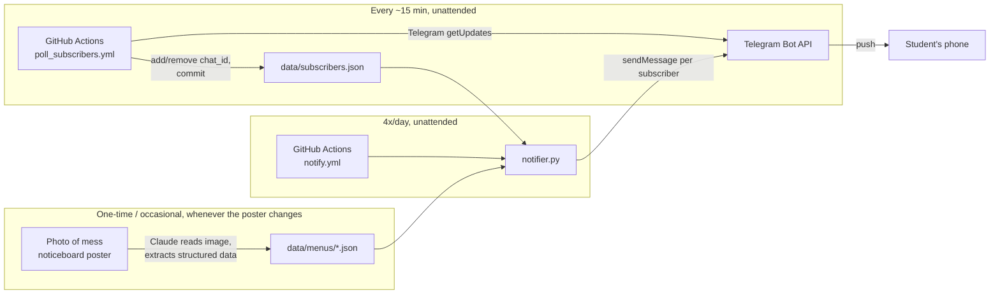

# NotiMess — Architecture

## 1. Overview

NotiMess is deliberately a **static-data + scheduled-script** system, not a live service. There's no server to keep running, no database beyond the repo itself, and no LLM call anywhere in the runtime path. The only "smart" step (reading the menu poster photo) happens once, offline, interactively with Claude — its output is a plain JSON file committed to the repo. Everything that runs on a schedule afterwards is small, dumb, and fast.

**Delivery channel: Telegram bot.** Chosen over a shared ntfy topic (no spoofing protection) and Web Push/PWA (needs a real backend + database + iOS limitations) — full comparison in §8. Since a Telegram bot needs no login and no per-user setup beyond `/start`, it serves both the original "notify me" goal and the "let anyone subscribe" goal at once — there's no separate personal-only build.



## 2. Why no external services beyond GitHub + Telegram

An earlier draft of this architecture planned a webhook-based design: a serverless function (Vercel/Cloudflare) receiving Telegram's `/start` events in real time, backed by a key-value store (Upstash Redis) for the subscriber list. That works, but it means creating and maintaining two more third-party accounts for what is, functionally, a list of chat IDs.

**Simplification adopted:** Telegram's Bot API supports *polling* (`getUpdates`) as well as webhooks — a client can just ask "any new messages since last time?" instead of needing a public HTTPS endpoint to receive pushes. So instead of a webhook function + Redis, a second GitHub Actions workflow polls every ~15 minutes, and the subscriber list is a JSON file **committed to the repo itself**, exactly like the menu data. This means:

- Only two accounts needed, total: GitHub (already have) and Telegram (need a bot via @BotFather).
- No new hosting platform, no database service, no secrets to manage outside GitHub Actions secrets.
- Trade-off accepted: a new subscriber's confirmation message arrives within ~15 minutes of `/start`, not instantly. Fine for "you'll start getting meal notifications" — nothing time-critical about the subscribe moment itself.
- Minor trade-off: the polling workflow commits to the repo on every run that has new activity (not on empty polls), which is a little unconventional but keeps everything in one place and auditable via git history.

## 3. Components

### 3.1 Menu data store — `data/menus/*.json`
- Single source of truth for what's being served.
- Structure: meal-major. Top-level `meals` object keyed by `breakfast`/`lunch`/`high_tea`/`dinner`, each carrying its time window (`time`, `counter_closing_time`) and an `items` object keyed by day name (`"Monday"`..`"Sunday"`) → flat list of dish strings. One file per institution+month (e.g. `vit_bhopal_mess_menu_september_2026.json`).
- Treated as **read-only by the scheduled jobs** — it only ever gets updated by a human (with Claude's help) re-parsing a new poster photo.
- The current file was corrected once already (see `MEMORY.md` change log, 2026-09-14) after a user-supplied re-transcription fixed several cells an earlier automated pass got wrong — a concrete reminder that a fresh poster photo should always be spot-checked, not just trusted from a single vision pass.

### 3.2 Subscriber store — `data/subscribers.json`
- Flat JSON array of Telegram `chat_id`s (numbers). Grows to `[{"chat_id": ..., "joined_at": ...}]` if/when per-subscriber preferences are ever added — not needed yet.
- Owned exclusively by `poll_subscribers.py` (below) — `notifier.py` only ever reads it.
- Committed to the repo by the poll workflow using the built-in `GITHUB_TOKEN` (no extra credential needed).

### 3.3 Subscriber poller — `poll_subscribers.py` + `.github/workflows/poll_subscribers.yml`
Runs on a `schedule` cron roughly every 15 minutes, plus `workflow_dispatch` for manual testing:
1. Call Telegram's `getUpdates` with an `offset` past the last-seen update ID (persisted alongside the subscriber list so the same `/start` is never double-processed).
2. For each new message:
   - `/start` → add the `chat_id` to `data/subscribers.json` if not already present, reply with a short welcome message.
   - `/stop` → remove the `chat_id` if present, reply with a goodbye/confirmation message.
   - Anything else → ignored (or a one-line "send /start to subscribe, /stop to unsubscribe" reply).
3. If anything changed, commit `data/subscribers.json` (and the persisted update offset) back to the repo.

### 3.4 Scheduler — GitHub Actions (`.github/workflows/notify.yml`)
- Chosen over local cron because it doesn't depend on any personal device being powered on (reliability requirement).
- Four `cron` triggers (UTC, since GitHub Actions cron doesn't support IST directly):

  | Meal | IST fire time | UTC cron |
  |---|---|---|
  | Breakfast | 07:15 | `45 1 * * *` |
  | Lunch | 12:00 | `30 6 * * *` |
  | High Tea | 16:45 | `15 11 * * *` |
  | Dinner | 19:00 | `30 13 * * *` |

  (IST = UTC+5:30; each row above is IST time minus 5:30.)
- Also exposes `workflow_dispatch` (manual trigger, with a `meal` input) for on-demand testing.
- GitHub Actions cron has a documented few-minutes jitter under load — acceptable given the 15-minute lead buffer before the counter actually opens.

### 3.5 Notifier script — `notifier.py`
Runtime logic, no external LLM/API dependency:
1. Determine which meal this run is for (passed in by the workflow step — simpler and more robust than inferring "which meal is next" from wall-clock time inside the script).
2. Look up `data/menus/<file>.json → meals[meal].items[weekday]` for the current `Asia/Kolkata` date.
3. Format title + body per the spec in `PRD.md` §8.
4. Load `data/subscribers.json`, loop over chat_ids, call Telegram's `sendMessage` for each.
5. If the slot's item list is empty or missing, still send a fallback "menu not available" message (FR6) rather than skipping silently.

Kept to a single file, stdlib + `requests` only — no framework needed for something this small.

### 3.6 Delivery — Telegram Bot API
- Bot created once via `@BotFather`, token stored as a GitHub Actions secret (`TELEGRAM_BOT_TOKEN`) — never committed to the repo.
- No account needed on the subscriber's end beyond Telegram itself, which the target audience already has.
- `chat_id` doubles as both the delivery address and the only "identity" NotiMess ever stores about a subscriber.

## 4. Data model

**Menu (`data/menus/*.json`):**
```jsonc
{
  "institution": "VIT Bhopal",
  "effective_from": "14th September 2026",
  "week": 1,
  "days": ["Monday", "Tuesday", "...", "Sunday"],
  "meals": {
    "breakfast": {
      "time": "07:30 AM to 09:30 AM",
      "counter_closing_time": "09:30 AM",
      "items": {
        "Monday": ["Idly", "Moong Dhal Sambar", "..."],
        "...": ["..."]
      }
    }
    // ... lunch, high_tea, dinner, same shape
  },
  "notes": ["..."]
}
```

**Subscribers (`data/subscribers.json`):**
```jsonc
{
  "last_update_id": 123456789,
  "chat_ids": [111111111, 222222222]
}
```

Design choices:
- **Flat string lists per day** in the menu — the notification just joins them with commas; the poster's own categorization doesn't need to survive into the message.
- **Meal-major, day-minor** (`meals.lunch.items.Monday`) — matches how the source poster itself is laid out.
- **One repeating 7-day cycle**, not a calendar of specific dates. If a genuine multi-week rotation is confirmed later (open question in `PRD.md`), a second dated file (`..._week2.json`) is the natural extension.
- **One file per institution+month** under `data/menus/` — a month-to-month menu change or a future second institution is just "add another file," never a schema change.
- **Subscribers as a flat array in one file**, not a per-user file or external DB — at hostel scale (hundreds, maybe low thousands of subscribers) a single JSON array committed to git is plenty, and it keeps the "no external services" property intact.

## 5. Menu update workflow (when the poster changes)

1. User photographs the new poster, drops it in the project directory.
2. User asks Claude (in this project) to re-parse it.
3. Claude reads the image, updates/adds the file in `data/menus/`.
4. Commit + push. Next scheduled `notify.yml` run picks up the new data automatically — no script/workflow changes needed for a pure menu content update.

## 6. Failure modes & handling

| Failure | Handling |
|---|---|
| `notify.yml` run fails (script error, Telegram API down) | GitHub emails the repo owner on workflow failure by default — free monitoring signal. |
| Telegram Bot API itself is down | Out of scope to mitigate for a free personal/community tool; acceptable occasional miss. |
| Menu JSON missing/malformed data for a slot | Script sends an explicit "menu not available" message instead of failing silently (FR6). |
| `poll_subscribers.yml` misses a run (GitHub Actions outage) | Self-healing: the next successful poll picks up everything since `last_update_id` — nothing is lost, just delayed. |
| Two workflow runs try to commit `data/subscribers.json` at once | Low risk at this scale (~15 min cadence, small polling window); if it ever happens, the losing job's push fails and can just retry against the updated file. |
| Poster's menu rotates on a cycle we don't know about | Flagged as an open question in `PRD.md`; not solvable until a second week's poster is observed. |

## 7. Tech stack

- **Language:** Python 3 (stdlib `json`, `datetime`/`zoneinfo`, plus `requests` for HTTP calls to the Telegram Bot API).
- **Scheduler/runtime:** GitHub Actions (`schedule` + `workflow_dispatch` triggers, two workflows).
- **Delivery:** Telegram Bot API (`sendMessage`, `getUpdates`).
- **Storage:** two JSON files in the repo (menu data, subscriber list) — no database, no external services.

## 8. Delivery channel comparison (recorded reasoning)

| | Shared ntfy topic | **Telegram bot (chosen)** | Web Push / PWA |
|---|---|---|---|
| App install needed | ntfy app | Telegram (near-universal already) | None (browser) |
| Backend needed | None | None (GitHub Actions polling — see §2) | DB + service worker + VAPID |
| Identity/auth | None (topic name = weak secret) | `chat_id` (free, built-in) | Push subscription object (free, built-in) |
| Spoofing risk | High — anyone with the topic name can publish to all subscribers | Low — only the bot (holds the token) can send | Low |
| iOS support | Full (native app) | Full (native app) | Limited — 16.4+, must Add to Home Screen |
| Effort to build | Lowest | Low | Highest |
| Ongoing cost | $0 | $0 | $0 (but more infra to maintain) |

WhatsApp Business API was also evaluated and ruled out on cost/complexity grounds — see `MEMORY.md` for the pricing breakdown (₹0.115–0.86 per message in India, no free tier for our proactive-message use case, plus business verification overhead).

## 9. Landing website

A static page, no login, no backend of its own — see `PLAN.md` Phase 2. Hosted on GitHub Pages. Its job is discovery/trust (explains the project, links to `t.me/<BotUsername>`), optionally showing a read of today's menu pulled from `data/menus/*.json`. It is not part of the notification delivery path.

## 10. Directory structure

```
NotiMess/
├── README.md
├── PRD.md
├── ARCHITECTURE.md
├── MEMORY.md
├── PLAN.md
├── menu.jpeg                              # source photo (Week 1, Sept 2026)
├── requirements.txt
├── notifier.py                            # sends the 4x/day meal notifications
├── poll_subscribers.py                    # polls Telegram, maintains data/subscribers.json
├── data/
│   ├── menus/
│   │   └── vit_bhopal_mess_menu_september_2026.json
│   └── subscribers.json
└── .github/
    └── workflows/
        ├── notify.yml                     # 4x/day cron → notifier.py
        └── poll_subscribers.yml           # ~every 15 min → poll_subscribers.py
```
